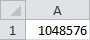
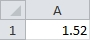
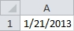

## <a name="pagetop" href="#pagetop">Data Types</a> ##
|Type				|Size	|Range									|
|-------------------|:-----:|---------------------------------------|
|[Byte](#byte)		|1 byte	|0 to 255								|
|[Boolean](#boolean)|2 bytes|True or False							|
|[Integer](#integer)|2 bytes|-32,768 to 32,767						|
|[Long](#long)		|4 bytes|-2,147,483,648 to 2,147,483,647		|
|[Single](#single)	|4 bytes|-3.402823E38 to -1.401298E-45 for negative values<br /> 1.401298E-45 to 3.402823E38 for positive values|
|[Double](#double)	|8 bytes|-4.94065645841247E-324 to -1.79769313486231E+308 for negative values<br />4.94065645841247E-324 to 1.79769313486232E308 for positive values	|
|[Currency](#currency)|8 bytes|-922,337,203,685,477.5808 to 922,337,203,685,477.5807|
|[Date](#date)|8 bytes|January 1, 100 to December 31, 9999|
|[String](#string)	|Length of string|0 to 2147483648				|
|[Variant](#variant)<br /><sub>(With Numbers)</sub>|16 bytes|Any numeric value up to the range of a **Double**|
|[Variant](#variant)<br /><sub>(With Characters)</sub>|22 bytes + string length|Same range as a **String**|
|[Object](#object)	|4 bytes|A generic type that can hold any object.|

----------
### <a name="byte" href="#byte">Byte</a> ###
A **Byte** can be any number between 0 and 255.

```VB
Sub Example()
	Dim b as Byte			'Create a variable of type Byte named 'b'
	b = 255					'Store the value 255 in b
	Range("A1").Value = b	'Set A1 to the value of b
End Sub
```

Result:
>

<sub>[Go to top](#pagetop)</sub>

----------

### <a name="boolean" href="#boolean">Boolean</a> ###
A **Boolean** value can be True or False.

```VB
Sub Example()
	Dim IsEqual as Boolean		'Create a variable of type Boolean named 'IsEqual'
	IsEqual = 1 = 2				'Store the result of 1 = 2 in IsEqual
	Range("A1").Value = IsEqual	'Set A1 to the value of IsEqual
End Sub
```

Result:
>

<sub>[Go to top](#pagetop)</sub>

----------
### <a name="integer" href="#integer">Integer</a> ###
An **Integer** can be any whole number between -32,768 and 32,767.

```VB
Sub Example()
    Dim i As Integer            'Create a variable of type integer named 'i'
    i = Sheet1.Columns.Count    'Store the number of columns on Sheet1 in i
    Range("A1").Value = i       'Set the value of cell A1 to the value of i
End Sub
```

Result:
>

<sub>[Go to top](#pagetop)</sub>

----------
### <a name="long" href="#long">Long</a> ###
A **Long** can be any whole number between -2,147,483,648 and 2,147,483,647.

```VB
Sub Example()
    Dim l As Long           'Create a variable of type long named 'l'
    l = Sheet1.Rows.Count   'Store the number of rows on Sheet1 in l
    Range("A1").Value = l   'Set the value of cell A1 to the value of l
End Sub
```

Result:
>

<sub>[Go to top](#pagetop)</sub>

----------
### <a name="single" href="#single">Single</a> ###
**Single** holds a single precision floating point value. Single precision numbers store an approximation of a real number. Only use this data type if you do not need the full width of a **Double** and precision is not important.

```VB
Sub Example()
    Dim s As Single			'Create a variable of type Single named 's'
    s = 0.105				'Store the .105 in s
    Range("A1").Value = s	'Set A1 to the value of s
End Sub
```

Result:
>

<sub>[Go to top](#pagetop)</sub>

----------
### <a name="double" href="#double">Double</a> ###
A **Double** is any number containing a floating point value.

```VB
Sub Example()
    Dim d As Double         'Create a variable of type Double named 'd'
    d = 1.52                'Store 1.52 in d
    Range("A1").Value = d	'Set A1 to the value of d
End Sub
```

Result:
>

<sub>[Go to top](#pagetop)</sub>

----------
### <a name="currency" href="#currency">Currency</a> ###
**Currency** can store up to 15 digits to the left of the decimal point and 4 digits to the right.

```VB
Sub Example()
    Dim c As Currency		'Create a variable of type Currency named 'c'
    c = 1.4					'Store 1.4 in c
    Range("A1").Value = c	'Set A1 to the value of c
End Sub
```

Result:
>

<sub>[Go to top](#pagetop)</sub>

----------
### <a name="date" href="#date">Date</a> ###
**Date** can be any date from January 1, 100 to December 31, 9999.
When specifying a date literal you must enclose the date with '#'.

```VB
Sub Example()
    Dim dt As Date			'Create a variable of type Date named 'dt'
    dt = #1/21/2013#		'Assign the date Jan 1, 2013 to dt
    Range("A1").Value = dt	'Set A1 to the value of dt
End Sub
```

Result:
>

<sub>[Go to top](#pagetop)</sub>

----------
### <a name="string" href="#string">String</a> ###
A **String** can be any [ASCII](./ASCII_Chart.html) character between 0 and 255. Characters 0 - 127 are letters and symbols on a standard US keyboard.

```VB
Sub Example()
    Dim Name As String			'Create a variable of type String named 'Name'
    Name = "Bob"				'Store Bob in Name
	Range("A1").Value = Name	'Set A1 to the value of Name
End Sub
```

Result:
>

<sub>[Go to top](#pagetop)</sub>

----------
### <a name="variant" href="#variant">Variant</a> ###
A **Variant** can hold any kind of data including Empty, Error, Nothing, and Null.

```VB
Sub Example()
    Dim MyVar As Variant  				'Create a variable  of type Variant named 'MyVar'

    MyVar = "A"							'Store the string A in MyVar
    Range("A1").Value = TypeName(MyVar) 'Set A1 to the current data type of MyVar

    MyVar = 1							'Store the integer 1 in MyVar
    Range("B1").Value = TypeName(MyVar) 'Set B1 to the current data type of MyVar

    MyVar = True						'Store the boolean value True in MyVar
    Range("C1").Value = TypeName(MyVar)	'Set C1 to the current data type of MyVar
End Sub
```

Result:
>

<sub>[Go to top](#pagetop)</sub>

----------
### <a name="object" href="#object">Object</a> ###
An **Object** is a container for an instance of an object or class.

```VB
Sub Example()
    Dim Person1 As Object					'Create a variable of type Object named 'Person1'
    Set Person1 = New Person				'Store a new instance of the Person class in Person1

    Person1.FirstName = "Donald"			'Set the property FirstName to Donald
    Person1.LastName = "Allen"				'Set the property LastName to Allen

    Range("A1").Value = Person1.FirstName	'Set A1 to the first name of Person1
    Range("B1").Value = Person1.LastName	'Set B1 to the last name of Person1
End Sub
```

Result:
>

<sub>[Go to top](#pagetop)</sub>

----------
<br /><br /><br /><br /><br /><br /><br /><br /><br />