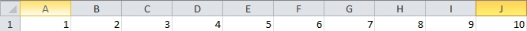

### <a name="Top" href="#Top">Data Types</a> ###

|Type|Min|Max|
|----|---|---|
|[Integer](#IntLong)|-32,768|32,767|
|[Long](#IntLong)|-2,147,483,648|2,147,483,647|
|[Double](#Double)|4.9406564584124654 × 10^−324|2.2250738585072009 × 10^308|
|[String](#String)|0|2147483648|
|[Boolean](#Boolean)|True|False|


|Type|Description|
|----|-----------|
|[Variant](#Variant)|Generic type that can contain all other types.|
|[Range](#Range)|An object that stores a single cell or a range cells.|
|[Object](#Object)|A generic type that can hold any object.|

**[^^^](#Top)**

----------
### <a name="IntLong" href="#IntLong">Integer / Long</a> ###
Any whole number between -32,768 and 32,767.


Notice how only the whole number is stored and the floating point number is lost.
```VB
Sub Example()
	Dim i as Integer
	Dim l as Long
	
	i = 8.5
	l = 8.5
	
	Debug.Print i 		'This prints 8
	Debug.Print i + l	'This prints 16
End Sub
```


Result:
>8
>16

**[^^^](#Top)**

----------
### <a name="Double" href="#Double">Variant</a> ###
Any number containing a floating point number.

```VB
Sub Example()
	Dim Money as Double
	
	Money = 5.5

	Debug.Print Money * 2		'Prints 11
End Sub
```
Result:
>11

**[^^^](#Top)**

----------
### <a name="String" href="#String">String</a> ###
Any ASCII character.

```VB
Sub Example()
	Dim FirstName as String
	Dim LastName as String

	FirstName = "Tanner"
	LastName = "Reische"

	Debug.Print FirstName & LastName	'Prints a persons name
End Sub
```
Result:
>Tanner Reische

**[^^^](#Top)**

----------
### <a name="Boolean" href="#Boolean">Boolean</a> ###
True of False.

```VB
Sub Example()
	Dim IsEqual as Boolean

	IsEqual = 1 = 1
	Debug.Print IsEqual		'Prints True

	IsEqual = "A" = "B"
	Debug.Print IsEqual		'Prints False
End Sub
```
Result:
>True
>False

**[^^^](#Top)**

----------
### <a name="Variant" href="#Variant">Variant</a> ###
A variant is like a container that can hold any data type.
This is useful if a function can return more than one type of data.

```VB
Sub Example()
    Dim NumberList As Variant
    Dim i As Integer

    NumberList = Array("1", "2", "3", "4")

    Debug.Print "NumberList is a " & TypeName(NumberList)
    Debug.Print "NumberList contains a list of " & TypeName(NumberList(0)) & "s"
    
	'Print every item in the array NumberList
    For i = 0 To UBound(NumberList)
        Debug.Print NumberList(i)
    Next
End Sub
```


Result:
>NumberList is a Variant()
>NumberList contains a list of Strings
>1
>2
>3
>4

**[^^^](#Top)**

----------
### <a name="Range" href="#Range">Range</a> ###
An range of cells on a worksheet.

```VB
Sub Example()
    Dim rng As Range
    Dim i As Integer
    
    Set rng = Sheets("Sheet1").Cells()
    rng.Range("A1:J1") = Array(1, 2, 3, 4, 5, 6, 7, 8, 9, 10)
End Sub
```
Result:
>

**[^^^](#Top)**

----------
### <a name="Object" href="#Object">Object</a> ###

----------