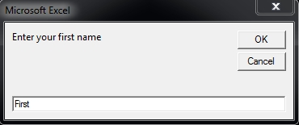
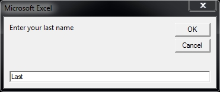

## <a name="pagetop" href="#pagetop">Data Types</a> ##

### <a name=primitives_top href=#primitives_top>Primitives</a> ###
|Type|Min|Max|
|----|---|---|
|[Integer](#intlong)|-32,768|32,767|
|[Long](#intlong)|-2,147,483,648|2,147,483,647|
|[Double](#double)|4.9406564584124654 × 10^−324|2.2250738585072009 × 10^308|
|[String](#string)|0|2147483648|
|[Boolean](#boolean)|True|False|

### <a name=objects_top href=#objects_top>Objects</a> ###
|Type|Description|
|----|-----------|
|[Variant](#variant)|Generic type that can contain all other types.|
|[Range](#range)|An object that stores a single cell or a range cells.|
|[Object](#object)|A generic type that can hold any object.|

----------
### <a name="intlong" href="#intlong">Integer / Long</a> ###
An **Integer** can be any whole number between -32,768 and 32,767.
A **Long** can be any whole number between -2,147,483,648 and 2,147,483,647.

```VB
Sub Example()
	Dim i as Integer	'Create a variable named 'i' of type Integer
	Dim l as Long		'Create a variable named 'l' of type Long
	
	i = 8.5		'Assign the value of 8.5 to i
	l = 8		'Assign the value of 8 to l
	
	'This prints 8, 0.5 is lost because
	'integers only store whole numbers
	Debug.Print i		'Write the value of i (8) to the screen

	'Notice how this equals 16 and not 16.5 since 0.5 was discarded
	Debug.Print i + l	'Write the value of i + l (16) to the screen
End Sub
```

Result:
>8
>16

<sub>[Go to top](#pagetop)</sub>

----------
### <a name="double" href="#double">Double</a> ###
A **Double** is any number containing a floating point value.

```VB
Sub Example()
	Dim Money as Double		'Create a variable named Money of type Double
	Money = 5.5				'Assign the value of 5.5 to Money
	Debug.Print Money * 2	'Write the value of Money * 2 (11) to the screen
End Sub
```

Result:
>11

<sub>[Go to top](#pagetop)</sub>

----------
### <a name="string" href="#string">String</a> ###
A **String** can be any ASCII character between 0 and 255. Characters 0 - 127 are printable characters.

```VB
Sub Example()
    Dim FirstName As String		'Create a variable named FirstName of type String
    Dim LastName As String		'Create a variable named LastName of type String

	'Prompt the user for their first name
    FirstName = InputBox(Prompt:="Enter your first name", Default:="First")

	'Prompt the user for their last name
    LastName = InputBox(Prompt:="Enter your last name", Default:="Last")

	'Write the users name to the screen
    Debug.Print FirstName & Space(1) & LastName  'Prints a persons name
End Sub
```

Result:
>
>
>
>
> First Last

<sub>[Go to top](#pagetop)</sub>

----------
### <a name="boolean" href="#boolean">Boolean</a> ###
A **Boolean** value is True or False.
```VB
Sub Example()
	Dim IsEqual as Boolean	'Create a variable named IsEqual of type Boolean

	IsEqual = 1 = 1			'Store the result of 1 = 1 (True)
	Debug.Print IsEqual		'Write the value of IsEqual to the screen (True)

	IsEqual = "A" = "B"		'Store the result of "A" = "B"
	Debug.Print IsEqual		'Write the value of IsEqual to the screen (False)
End Sub
```
Result:
>True
>False

<sub>[Go to top](#pagetop)</sub>

----------
### <a name="variant" href="#variant">Variant</a> ###
A **Variant** can hold any kind of data including Empty, Error, Nothing, and Null.

```VB
Sub Example()
    Dim MyVar As Variant   'Create a variable named MyVar of type Variant

    MyVar = "A"                               	'Store A in MyVar
    Debug.Print "MyVar is a " & TypeName(MyVar) 'Write the data type of Var to the screen

    MyVar = 1                                	'Store 1 in MyVar
    Debug.Print "MyVar is a " & TypeName(MyVar) 'Write the data type of Var to the screen

    MyVar = True								'Store True in MyVar
    Debug.Print "MyVar is a " & TypeName(MyVar) 'Write the data type of Var to the screen
End Sub
```

Result:
>MyVar is a String
>MyVar is a Integer
>MyVar is a Boolean

<sub>[Go to top](#pagetop)</sub>

----------
### <a name="range" href="#range">Range</a> ###
A **Range** is one or more cells on a worksheet.

```VB
Sub Example()
    Dim rng As Range    'Create a variable named rng of type Range
    Dim i As Integer    'Create a variable named i of type Integer

    'Set rng equal to cells A1 - J1 on Sheet1
    Set rng = Sheets("Sheet1").Range("A1:J1")

    'Write 1 - 10 in rng
    rng = Array(1, 2, 3, 4, 5, 6, 7, 8, 9, 10)
End Sub
```

Result:
>

<sub>[Go to top](#pagetop)</sub>

----------
### <a name="object" href="#object">Object</a> ###
An **Object** is a container for an instance of an object or class.

```VB
Sub Example()
    Dim oHTTP As Object		'Create an object variable named oHTTP

	'Store the object WinHttp.WinHttpRequest.5.1 in oHTTP
    Set oHTTP = CreateObject("WinHttp.WinHttpRequest.5.1")
	
	'Members of the WinHttpRequest object are now accessible
	'through the oHTTP object variable

	'Initialize an HTTP GET request for the specified URL
    oHTTP.Open "GET", "http://halfcrap.com/vba/files/example.txt", False
	
    oHTTP.Send				'Send the HTTP request
    oHTTP.WaitForResponse	'Wait for a response

	'Write the result to the screen
	Debug.Print oHTTP.responseText
End Sub
```

Result:
>example

<sub>[Go to top](#pagetop)</sub>

----------