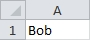
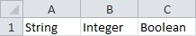
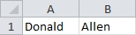

## <a name="pagetop" href="#pagetop">Data Types</a> ##

### <a name=32Bit_DataTypes href=#32Bit_DataTypes>Primitives</a> ###
|Type|Size|Range|
|----|:--------:|-----|
|[Byte](#byte)		|1 byte	|0 to 255|
|[Boolean](#boolean)|2 bytes|True or False|
|[Integer](#integer)|2 bytes|-32,768 to 32,767|
|[Long](#intlong)	|4 bytes|-2,147,483,648 to 2,147,483,647|
|[Double](#double)	|8 bytes|-4.94065645841247E-324 to -1.79769313486231E+308 for negative values<br />4.94065645841247E-324 to 1.79769313486232E308 for positive values|
|[String](#string)	|Length of string|0 to 2147483648|

### <a name=objects_top href=#objects_top>Objects</a> ###
|Type|Description|
|----|-----------|
|[Variant](#variant)|Generic type that can contain all other types.|
|[Range](#range)|An object that stores a single cell or a range cells.|
|[Object](#object)|A generic type that can hold any object.|

----------
### <a name="integer" href="#integer">Integer / Long</a> ###
An **Integer** can be any whole number between -32,768 and 32,767.

```VB
Sub Example()
	Dim i as Integer			'Create a variable of type integer named 'i'
	i = 8						'Store 8 in 'i'
	Range("A1").Value = i		'Set the value of cell A1 to the value of 'i'
End Sub
```

Result:
>

<sub>[Go to top](#pagetop)</sub>

----------
### <a name="double" href="#double">Double</a> ###
A **Double** is any number containing a floating point value.

```VB
Sub Example()
    Dim d As Double         'Create a variable of type Double named 'd'
    d = 1.52                'Store 1.52 in 'd'
    Range("A1").Value = d	'Set A1 to the value of 'd'
End Sub
```

Result:
>

<sub>[Go to top](#pagetop)</sub>

----------
### <a name="string" href="#string">String</a> ###
A **String** can be any ASCII character between 0 and 255. Characters 0 - 127 are printable characters.

```VB
Sub Example()
    Dim Name As String			'Create a variable of type String named 'Name'
    Name = "Bob"				'Store Bob in 'Name'
	Range("A1").Value = Name	'Set A1 to the value of 'Name'
End Sub
```

Result:
>

<sub>[Go to top](#pagetop)</sub>

----------
### <a name="boolean" href="#boolean">Boolean</a> ###
A **Boolean** value is True or False.
```VB
Sub Example()
	Dim IsEqual as Boolean		'Create a variable of type Boolean named 'IsEqual'
	IsEqual = 1 = 2				'Store the result of 1 = 2 in 'IsEqual'
	Range("A1").Value = IsEqual	'Set A1 to the value of 'IsEqual'
End Sub
```
Result:
>

<sub>[Go to top](#pagetop)</sub>

----------
### <a name="variant" href="#variant">Variant</a> ###
A **Variant** can hold any kind of data including Empty, Error, Nothing, and Null.

```VB
Sub Example()
    Dim MyVar As Variant   'Create a variable  of type Variant named 'MyVar'

    MyVar = "A"							'Store the string A in 'MyVar'
    Range("A1").Value = TypeName(MyVar) 'Set A1 to the current data type of 'MyVar'

    MyVar = 1							'Store the integer 1 in 'MyVar'
    Range("B1").Value = TypeName(MyVar) 'Set B1 to the current data type of 'MyVar'

    MyVar = True						'Store the boolean value True in 'MyVar'
    Range("C1").Value = TypeName(MyVar)	'Set C1 to the current data type of 'MyVar'
End Sub
```

Result:
>

<sub>[Go to top](#pagetop)</sub>

----------
### <a name="range" href="#range">Range</a> ###
A **Range** is one or more cells on a worksheet.

```VB
Sub Example()
    Dim rng As Range									'Create a variable of type Range named 'rng'
    Set rng = Sheets("Sheet1").Range("A1:J1")			'Set rng equal to cells A1 - J1 on Sheet1
    rng.Value = Array(1, 2, 3, 4, 5, 6, 7, 8, 9, 10)	'Write 1 to 10 in rng
End Sub
```

Result:
>

<sub>[Go to top](#pagetop)</sub>

----------
### <a name="object" href="#object">Object</a> ###
An **Object** is a container for an instance of an object or class.

```VB
Sub Example()
    Dim Person1 As Object					'Create a variable of type Object named 'Person1'
    Set Person1 = New Person				'Store a new instance of the Person class in 'Person1'
    Person1.FirstName = "Donald"			'Set the property FirstName to Donald
    Person1.LastName = "Allen"				'Set the property LastName to Allen
    Range("A1").Value = Person1.FirstName	'Set A1 to the first name of Person1
    Range("B1").Value = Person1.LastName	'Set B1 to the last name of Person1
End Sub
```

Result:
>

<sub>[Go to top](#pagetop)</sub>

----------