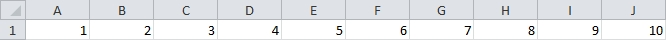
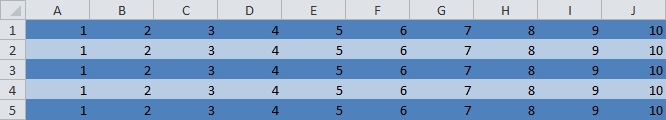
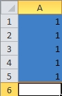
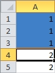
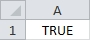
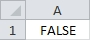
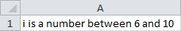

## <a name="pagetop" href="#pagetop">Loops and Logic</a> ##
|Section    			|Description												|
|:---------------------:|-----------------------------------------------------------|
|[For](#for)		|Repeat a block of code a certain number of times				|
|[Do Until](#dountil)	|Repeat a block of code until a condition is met			|
|[Do While](#dowhile)	|Repeat a block of code while a condition is true			|
|[If Then Else](#if)	|If a condition is met run a block of code					|
|[Select Case](#selcase)|Choose which block of code to run based on somethings value|
----------

### <a name="for" href="#for">For</a> ###
A **For** loop repeats a block of code the specified number of times.

```VB
Sub Example()
    Dim i As Integer   			'Create a variable to use as a loop counter
    							'Repeat code between 'For' and 'Next' until 'i' reaches 10
    For i = 1 To 10 Step 1		'Start i at 1, increment i by 1, stop if i equals 10
        Cells(1, i).Value = i   'Set the value of Row 1, Column number 'i' to the value of i
    Next						'Increment loop counter and start next loop iteration
End Sub
```

Result:
>

--
For loops are very useful if you want to repeat a block of code on every row or column.

*Note: `Step 1` is omitted from the for loop in this example. `Step 1` is the default and does not need*
*to be specified unless you want to change it. For example you can step backwards using `Step -1`.*

Here is an example that gives rows alternating colors
```VB
Sub Example()
    Dim i As Integer                            'Create a variable to use as a loop counter
    Dim TotalRows As Long                       'Create a variable to hold the number or rows on Sheet1
    TotalRows = Sheet1.UsedRange.Rows.Count     'Set TotalRows to the number of rows containing data on Sheet1

    'Repeat code between 'For' and 'Next'
    'until 'i' equals the number of rows on Sheet1
    For i = 1 To TotalRows
        If i Mod 2 = 0 Then                                                     'If i is an even number
            Sheet1.UsedRange.Rows(i).Interior.Color = RGB(184, 204, 228)        'Color the row light blue
        ElseIf i Mod 2 = 1 Then                                                 'If i is an odd number
            Sheet1.UsedRange.Rows(i).Interior.Color = RGB(79, 129, 189)         'Color the row dark blue
        End If
    Next
End Sub
```

Result:
>

<sub>[Go to top](#pagetop)</sub>

----------
### <a name="dountil" href="#dountil">Do Until</a> ###
A **Do Until** loop repeats a block of code until a condition is met.

```VB
Sub Example()
    Range("A1").Select                                  'Select cell A1
    Do Until Selection.Value = ""                       'Repeat the code between 'Do' and 'Loop' until a blank cell is selected
        Selection.Interior.Color = RGB(64, 128, 200)    'Color the selected cell blue
        Selection.Offset(1, 0).Select                   'Select the cell below our current selection
    Loop
End Sub
```

Result:
>

<sub>[Go to top](#pagetop)</sub>

----------
### <a name="dowhile" href="#dowhile">Do While</a> ###
A **Do While** loop repeats a block of code while a condition is true.

```VB
Sub Example()
    Range("A1").Select                                  'Select cell A1
    Do While Selection.Value = "1"                      'Repeat code between 'Do' and 'Loop' while the selected cell is 1
        Selection.Interior.Color = RGB(64, 128, 200)    'Color the selected cell blue
        Selection.Offset(1, 0).Select                   'Select the cell below our current selection
    Loop                                                'Start next loop iteration
End Sub
```

Result:
>

<sub>[Go to top](#pagetop)</sub>

----------
### <a name="if" href="#if">If, Then, Else</a> ###
An **If** statment executes a block of code if a statement is true or false.

```VB
Sub Example()
    Const B As Boolean = True   	'Create a constant with it's value set to true

    If B = True Then                'If B is True Then
        Range("A1").Value = "True"  'Set A1 to "True"
    End If                          'End our if statement
End Sub
```

Result:
>

--
You can use an **Else** statement to define what happens if the boolean operation is not true.

```VB
Sub Example()
    Const B As Boolean = False   		'Create a constant with it's value set to false

    If B = True Then                    'if B is True then
        Range("A1").Value = "True"      'Set A1 to "True"
    Else                                'if B is not True then
        Range("A1").Value = "False"     'Set A1 to "False"
    End If                              'Let the computer know our if statement is done
End Sub
```

Result:
>

--
You an also use an **ElseIf** statement to have an additional logic check if your original boolean operation is not true.

```VB
Sub Example()
    Const i As Integer = 2                      'Create a constant with it's value set to 1

    If i = 1 Then                               'If i = 1 then
        Range("A1").Value = "i = 1"             'Set A1 to "i = 1"
    ElseIf i = 2 Then                           'If i is not 1 and i = 2 then
        Range("A1").Value = "i = 2"             'Set A1 to "i = 2"
    Else                                        'If i is not 1 or 2 then
        Range("A1").Value = "i isn't 1 or 2"    'Set A1 to "i isn't 1 or 2"
    End If                                      'Lets the computer know to end our if statment
End Sub
```

Result:
>

<sub>[Go to top](#pagetop)</sub>

----------
### <a name=selcase ref=#selcase>Select Case</a> ###
A **Select Case** statement allows you to run a block of code based on a variable or objects value.

```VB
Sub Example()
    Const i As Integer = 10     'Create an integer named i and set its value to 10

    Select Case i				'Check the value of i
        Case 1:                             'If i is 1
            Range("A1").Value = "i = 1"     'Set A1 to "1 = 1"
        Case 3, 5:                                      'If i is 3, 4, or 5
            Range("A1").Value = "i is 3, 4, or 5"       'Set A1 to "i is 3, 4, or 5"
        Case 6 To 10:                                               'If i is 6, 7, 8, 9, or 10 (the specified range is inclusive)
            Range("A1").Value = "i is a number between 6 and 10"    'Set A1 to "i is a number 6 to 10"
        Case Else                                                               'If none of the above statments are true
            Range("A1").Value = "i is less than 1, greater than 10, or is 4"    'Put this sentence in cell A1
    End Select
End Sub
```

Result:
>

<sub>[Go to top](#pagetop)</sub>

----------
<br \><br \><br \><br \><br \><br \><br \><br \><br \>