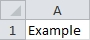

## <a name="pagetop" href="#pagetop">Cells and Ranges</a> ##

|Section    			|Description												|
|:---------------------:|-----------------------------------------------------------|
|[Cells](#cells)		|References a single cell as a **Range** object				|
----------

### <a name="cells" href="#cells">Cells</a> ###
**Cells** returns a **Range** object to a single cell. The cell is specified by its row and column number.

```VB
Sub Example()
	'Cells(Row, Column)
	Cells(1, 1).Value = "Example"	'Sets cell A1 to "Example"		
End Sub
```

Result:
>

--

### <a name="range" href="#range#>Range</a> ###
**Range** returns a **Range** object to one or many cells.